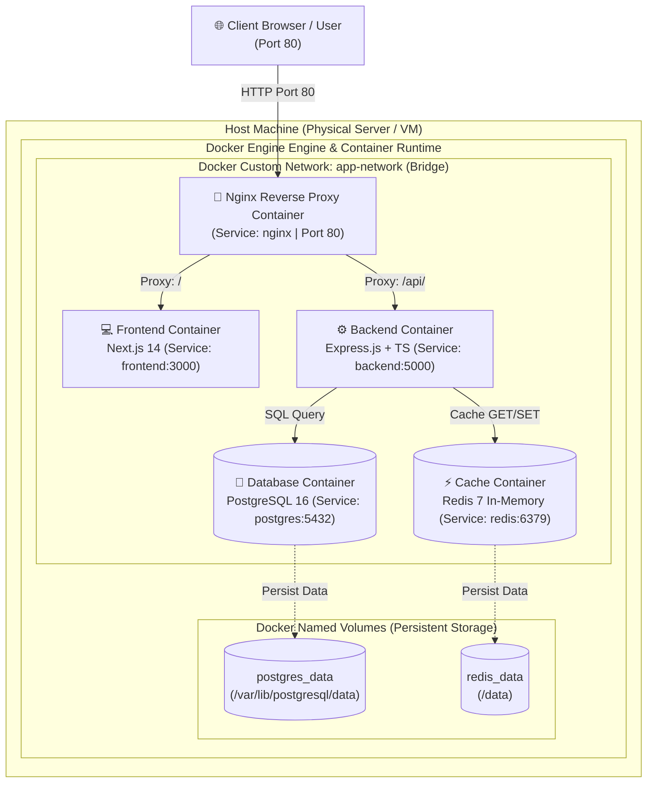
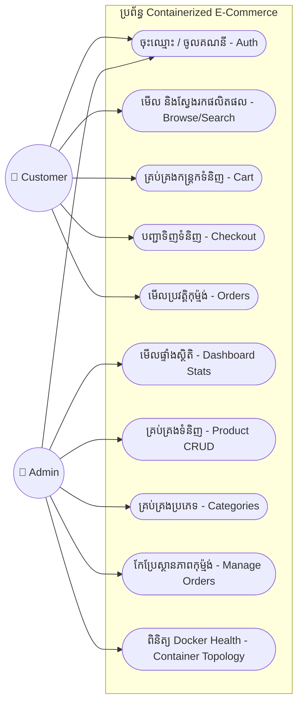
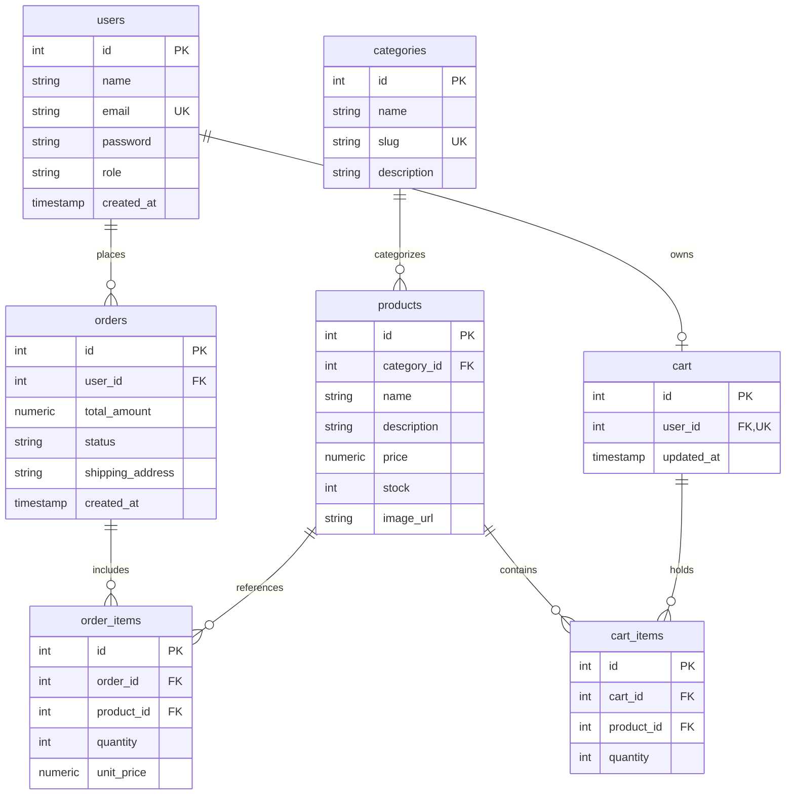

# ស្ថាបត្យកម្មប្រព័ន្ធ និងដ្យាក្រាម (System Architecture & Diagrams)

ឯកសារនេះបង្ហាញពីស្ថាបត្យកម្មរួមនៃប្រព័ន្ធ ដ្យាក្រាម Use Case និងទម្រង់ទិន្នន័យ Database ERD។

---

## ១. ដ្យាក្រាមស្ថាបត្យកម្មប្រព័ន្ធ (System Architecture Diagram)

ប្រព័ន្ធនេះត្រូវបានរៀបចំឡើងតាមបែប **Microservice & Multi-Container Tiered Architecture**៖

---

## ២. ដ្យាក្រាម Use Case (Use Case Diagram)

---

## ៣. ដ្យាក្រាមទិន្នន័យ Database ERD (Entity Relationship Diagram)

តារាងទាំងអស់ត្រូវបានរៀបចំក្នុង PostgreSQL Container ដែលមាន Foreign Keys និង Constraints ច្បាស់លាស់៖

